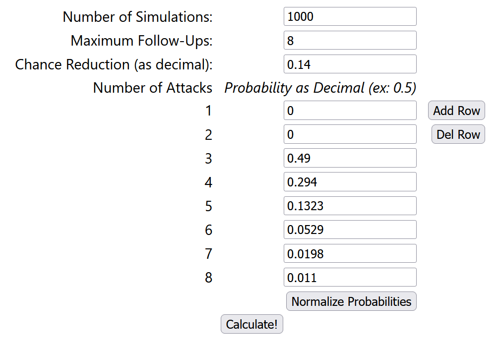

# EO Chaser Calculator

**Link**: [https://aturfah.github.io/eo-chaser-calc](https://aturfah.github.io/eo-chaser-calc)

For Etrian Odyssey games, calculate the expected number of follow-up attacks for chaser-type skills.

## Arguments

Below I will provide an brief explanation of the arguments the page accepts.

- **Maximum Follow-Ups**: The upper limit of the number of follow-up attacks that can occur.
- **Chance Reduction**: The follow-up chance reduction after each successful chase.
- **Number of Attacks (Probability)**: The probability of each number of attacks that can proc a follow-up occurring, entered as a decimal (ex; 0.5)
  - _Note:_ The variable number of attacks is to allow skills like Swashbuckling which may activate any number of times. If you have a fixed number of attacks then type that number with probability 1.
- **Number of Simulations**: Number of samples to draw to get results. Larger numbers result in more stable estimates, at the cost of time.

## Example

- Buccaneer with Lv8 Chase Flame (14% Chance Reduction, Max 8 Follow-Ups)
- Ally Zodiac will proc 1 chase
- Ally Shogun/Buccaneer will proc variable number of chases via imbued Lv8 Swashbuckling
    - 2 Hits: 49.00%
    - 3 Hits: 29.40%
    - 4 Hits: 13.23%
    - 5 Hits: 5.29%
    - 6 Hits: 1.98%
    - 7 Hits: 1.10%
- Inputs look like this

## Logic

The procedure for generating the the number of follow-ups for a single step is described below. This processs is repeated `Number of Simulations` number of times.

1. Draw the number of attacks that cac proc a follow-up according to the specified distribution (`Number of Attacks (Probability)`)
2. Initialize follow-up probability (FP) to 100% and the follow-up counter to 0
3. For each attack that can potentially proc a follow-up
   1. This attack results in a follow-up with probability FP
   2. If a follow-up occurs, increment the follow-up counter and decrease the FP by `Chance Reduction`
   3. If FP < 0 or we have reached the maxmimum number of follow-up attacks, stop
4. Return the value of the follow-up counter

The exact implementation details can be found in the `runSimulation` function from `/src/App.js`